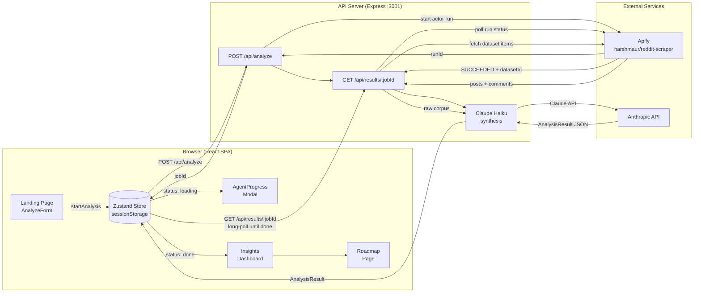

# Tokens Gone Wild

Agentic AI Product Manager — paste a product or company name and get a live analysis of customer sentiment, pain points, feature requests, competitor threats, and a prioritized roadmap, all sourced from real Reddit conversations.

## Architecture



**Flow summary:**
1. User submits a query → frontend calls `POST /api/analyze`
2. Server starts an Apify Reddit scraper run and returns the `jobId` immediately
3. Frontend calls `GET /api/results/:jobId` — this is a long-poll that holds open until done
4. Server polls Apify every 4s until the run succeeds, then fetches the dataset (top posts + comments)
5. Server sends the raw corpus to Claude Haiku, which extracts structured `AnalysisResult` JSON
6. Response returns to the frontend; Zustand stores it and the router navigates to `/insights`

## Prerequisites

- Node.js v20+
- pnpm v10+ (**do not use npm** — rolldown's native bindings require pnpm to resolve correctly)

```bash
npm install -g pnpm
```

## Setup

```bash
pnpm install
```

Copy `.env.example` to `.env` and fill in your keys:

```bash
cp .env.example .env
```

```
APIFY_TOKEN=your_apify_token
ANTHROPIC_API_KEY=your_anthropic_api_key
```

## Running locally

Two terminals are required — the API server and the Vite dev server run separately.

**Terminal 1 — API server**
```bash
pnpm server
```

**Terminal 2 — frontend**
```bash
pnpm dev
```

Then open [http://localhost:5173](http://localhost:5173).

Vite proxies all `/api/*` requests to the Express server on `:3001`.

> **Demo mode:** if the API server is not running, the frontend falls back to static demo data for `kiro`, `notion`, and `siri`. Use the pill buttons on the landing page to trigger these.

## Other commands

```bash
pnpm build      # type-check + Vite production build → dist/
pnpm preview    # serve the production build locally
```

## Tech stack

| Layer | Tools |
|---|---|
| Frontend | React 19, TypeScript, Vite 8, Tailwind CSS 4, Framer Motion, Recharts, Zustand, React Router 7 |
| Backend | Node.js, Express 5, tsx |
| Scraping | Apify — `harshmaur/reddit-scraper` |
| Synthesis | Anthropic SDK — Claude Haiku |
